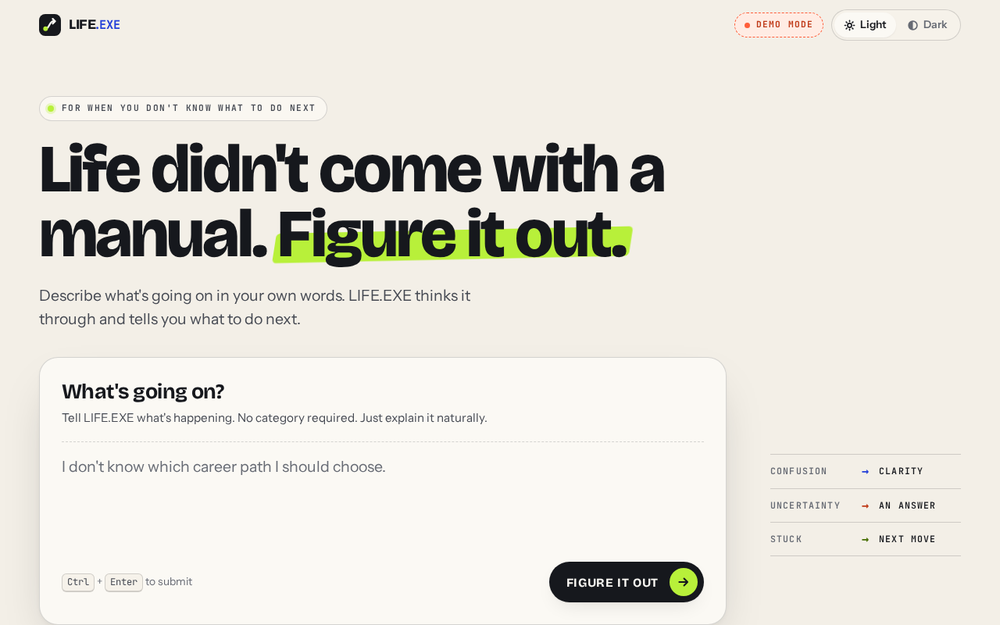
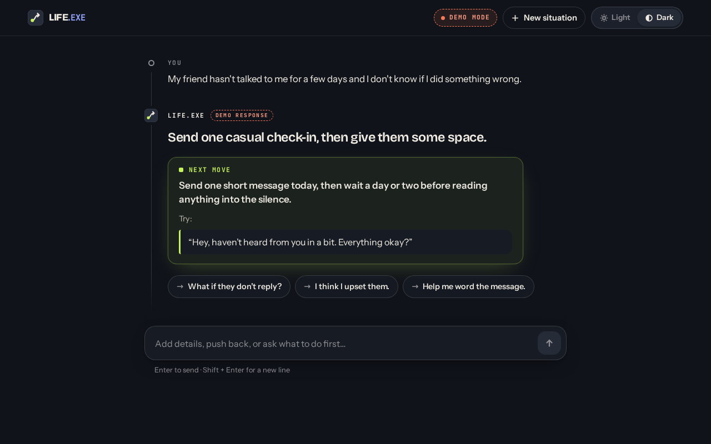

# LIFE.EXE

**Life didn't come with a manual. Figure it out.**

LIFE.EXE is a small decision-support tool for real-life situations. You describe what's going on in your own words, and it tells you what it would do and what to do next, without explaining your situation back to you. Then you keep talking it through: push back, add details, or ask for help with what to say.

The idea: **complexity in, thinking behind the scenes, simplicity out.**





## How it works

1. **You explain the situation.** No categories or forms, just plain language.
2. **LIFE.EXE thinks it through, quietly.** It works out what you're really asking, what you know versus what you're assuming, and which approach is most practical. You see its progress (Understanding → Thinking → Preparing answer), never its reasoning.
3. **You get a short answer:** what it would do, one practical **next move**, the words to use when wording helps (like a message to send), and two or three follow-ups you can tap. Longer answers, a few bullet points or an alternative only appear when the situation genuinely calls for them. If one missing detail would change the advice, it asks one short question.
4. **You continue the conversation.** Tap a follow-up or type your own; it stays part of the same situation. Conversations are saved in your browser, so you can come back to a situation later and pick it up where you left off.

For example, "my friend hasn't talked to me in a few days, should I msg him again?" gets: *Yes — send one casual check-in, then give them some space.* Next move: *Send one short message today, then wait a day or two before reading anything into the silence.* Try: *"Hey, haven't heard from you in a bit. Everything okay?"*

LIFE.EXE doesn't diagnose, doesn't claim to know what other people think, and points to real-world help when a situation is serious. If someone may be in danger, safety comes first.

## Run it locally

You need [Node.js](https://nodejs.org/) 22.18 or newer.

```bash
npm install
npm run dev
```

Open http://localhost:5173. Without an API key, LIFE.EXE runs in **demo mode** (see below), so it works straight away.

## Connect the AI

LIFE.EXE uses Google Gemini for live answers, through Google's official Gen AI SDK (`@google/genai`).

1. Create a Gemini API key in [Google AI Studio](https://aistudio.google.com/apikey). The Gemini API has a free tier with usage limits.
2. Copy the example environment file and add your key:

   ```bash
   cp .env.example .env
   ```

   ```bash
   # .env
   GEMINI_API_KEY=your-key-here
   ```

3. Restart `npm run dev`. The "Demo mode" badge disappears once the live AI is connected.

| Variable         | Required    | Default            | What it does                                                         |
| ---------------- | ----------- | ------------------ | -------------------------------------------------------------------- |
| `GEMINI_API_KEY` | For live AI | (none)             | Your Gemini API key. Leave it empty to run in demo mode.             |
| `GEMINI_MODEL`   | No          | `gemini-3.8-flash` | Which Gemini model to use, for example `gemini-3.5-flash-lite` for faster answers. |

The key is only ever read on the server (the Netlify Function, or the local dev server). It is never sent to the browser or included in the built site. `.env` is git-ignored; never commit a real key.

## Demo mode

When no `GEMINI_API_KEY` is set, LIFE.EXE answers with pre-written responses instead of calling an AI. This keeps the app usable for demonstrations without a key or an internet connection to the AI.

- Demo responses cover six common situations (a career choice, a friend who's gone quiet, a difficult conversation, two opportunities, a decision you regret, and your wants versus other people's expectations) and a general fallback, in the same short format as live answers. Every follow-up button they offer has its own pre-written reply, and common follow-ups like "Can you be more direct?" or "What should I do first?" work too. Anything else gets an honest "demo mode can't adapt to new details" reply.
- If a message suggests someone may be in danger, demo mode always responds with a support message pointing to emergency services and crisis lines.
- Demo mode is always labelled: a **Demo mode** badge in the header, a note under the input, and a **Demo response** tag on every answer. Demo answers are never presented as live AI.

## Conversation memory

LIFE.EXE remembers conversations in the browser, so someone coming back on the same browser and device can continue a situation where they left off. There's no account and no database.

- **What's saved, and where.** Each situation is saved in the browser's `localStorage` (key `lifeexe-memory`, a small versioned JSON document): its ID, the messages and LIFE.EXE's answers with their timestamps, when it was started and last updated, and a short summary (LIFE.EXE's title for the situation). Two small keys remember which situation was open (`lifeexe-last-open` in localStorage, `lifeexe-open` per tab in sessionStorage). Nothing else is stored: no API keys, no configuration, no error details.
- **Coming back.** Opening LIFE.EXE again, after a reload or days later, reopens the situation you were in, as you left it, so you can simply keep typing. (A reply that was still being written when you left shows as interrupted, with **Try again**.) Nothing is sent when the page opens: a request is only made when you send a message.
- **Other situations.** **New situation** goes back to the home page, where saved situations are listed under the input ("Pick up where you left off"); choose one to continue it.
- **Separate situations stay separate.** "New situation" starts a fresh conversation and keeps the previous one saved. When you continue a situation, only that conversation goes with your message, the same way it always has; other situations are never sent. A very long thread is trimmed to the API's limit of 40 messages by keeping its opening exchange (where the situation was first described) and its most recent messages.
- **Clear local memory.** The link under the list of saved situations deletes every saved situation from the browser, after asking you to confirm. It doesn't touch the theme, the server, or the Gemini configuration.
- **Limits.** Memory keeps the 50 most recently used situations, and makes room the same way if the browser's storage fills up. If the browser blocks storage, LIFE.EXE still works; conversations just aren't saved.

Saved conversations stay on the device, but they aren't encrypted, and anyone using the same browser profile can open them. When you send a message, the conversation you're in is sent to LIFE.EXE's server and, in live mode, to the Gemini API (see the free-tier privacy note below). The About section of the home page explains this in plain language.

## Deploy to Netlify

The project is set up for Netlify: `netlify.toml` defines the build, and `netlify/functions/life.ts` serves the API at `/api/life`.

1. Push this repository to GitHub.
2. In Netlify, create a new project and import the repository from GitHub. The build settings are read from `netlify.toml` (build command `npm run build`, publish directory `dist`, Node 22), so there is nothing to change.
3. To use the live AI, add `GEMINI_API_KEY` in the project's **Environment variables** settings (make sure its scopes include Functions), then trigger a new deploy. Optionally add `GEMINI_MODEL`. Don't put the key in `netlify.toml` or anywhere in the code.

Without `GEMINI_API_KEY`, the deployed site runs in demo mode. One exception: if Netlify's AI Gateway is turned on for your site, Netlify can supply AI credentials to functions automatically, and LIFE.EXE will then run in live mode even though you didn't add a key.

A few things to know before sharing a live deployment:

- **Anyone with the link can use your key.** On the free tier, heavy use runs into Google's rate limits (LIFE.EXE then says it's handling a lot right now) rather than costing money. If you enable billing on the key's Google Cloud project, keep an eye on usage.
- **Privacy on the free tier.** Google's Gemini API terms say free-tier prompts and responses may be used to improve Google's products and may be read by human reviewers. People describe personal situations here, so check the current terms, and consider a paid tier before sharing the app widely.
- **Response time.** Netlify stops functions after a time limit (about 30 seconds by default). LIFE.EXE streams its progress, asks the model for quick (low) thinking and keeps answers short, so a normal answer finishes well within that. If you see "That took longer than it should have", choose a faster `GEMINI_MODEL`.

## Project structure

```
index.html                  Page shell (sets the saved theme before first paint)
netlify.toml                Netlify build, functions and headers
netlify/functions/life.ts   Netlify Function: serves /api/life
server/                     API layer and AI service (no browser code)
  handler.ts                HTTP handling: validation, streaming, errors
  validation.ts             Checks incoming conversations
  providers/                One file per AI provider, behind one interface
    gemini.ts               Google Gemini via the @google/genai SDK (streamed structured output)
    demo.ts                 Demo mode
  demo/                     Demo mode's pre-written responses and matching logic
  prompt.ts                 LIFE.EXE's instructions to the model
  schema.ts                 The structured response format, and its validation
  stages.ts                 Turns the streamed answer into progress stages
  node-adapter.ts           Lets the Vite dev server run the same handler locally
shared/contract.ts          Types and limits shared by the browser and the server
src/                        The React app
  features/home/            Home page: the situation input, saved situations, how it works, about
  features/workspace/       Conversation, answers, processing sequence, composer
  hooks/                    Conversation state, theme, media queries
  lib/                      API client, conversation state, local memory, error messages, formatting
  styles/                   Design tokens (light and dark) and base styles
```

### How a request flows

```
Browser ──POST /api/life──▶ handler ──▶ provider (Gemini or demo) ──▶ structured answer
   ▲                          │
   └──── server-sent events ──┘   meta → stage (×3) → result | error
```

With each message the browser sends the conversation being continued, and only that one; nothing is stored on the server. Conversations are saved in the browser instead (see [Conversation memory](#conversation-memory)).

### The answer format

Every answer, live or demo, has the same shape (`LifeResponse` in `shared/contract.ts`), validated on the server by `server/schema.ts`. Empty strings and lists mean "nothing to show", and most answers leave several of them empty.

| Field         | What it's for                                                              |
| ------------- | -------------------------------------------------------------------------- |
| `answer`      | The direct answer, usually one to four sentences                            |
| `nextMove`    | The single most practical thing to do now                                   |
| `scripts`     | Words to use, only when wording helps (up to three)                         |
| `followUps`   | Two or three things to ask next, shown as buttons                           |
| `points`      | A few short points, only when they genuinely help (up to four)              |
| `alternative` | Another approach, only when a real trade-off makes it worth mentioning      |
| `question`    | One clarifying question, only when the advice depends on it                 |
| `care`        | A safety note pointing to real help, only when someone may be at risk       |
| `title`       | A short name for the situation, shown only in the list of saved situations  |

### Switching AI providers

Providers implement the `LifeProvider` interface in `server/providers/types.ts`: take the conversation, report progress stages, and return a `LifeResponse`. To use another provider, add a file next to `gemini.ts` and select it in `createProvider` in `server/handler.ts`. Nothing in the browser needs to change.

## Scripts

| Command             | What it does                                                    |
| ------------------- | --------------------------------------------------------------- |
| `npm run dev`       | Start the app and API locally with hot reload                   |
| `npm run build`     | Type-check and build the production site into `dist/`          |
| `npm run preview`   | Serve the production build locally, API included                |
| `npm test`          | Run the tests (Node's built-in test runner)                     |
| `npm run typecheck` | Type-check everything                                           |
| `npm run lint`      | Lint with oxlint                                                |

## Tech

React 19, TypeScript, Vite, plain CSS with custom properties, Google's Gen AI SDK for Gemini, zod for response validation, and Netlify Functions. Fonts are self-hosted: Bricolage Grotesque, Instrument Sans and JetBrains Mono.
